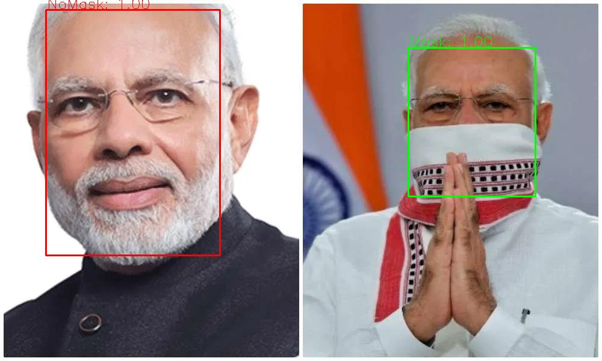

# FaceMaskDetection


** Detect faces and determine whether they are  wearing mask. **


** First of all, we hope the people in the world defeat COVID-2019 as soon as possible. Stay strong, all the countries in the world.**


* We published 7959 images to train the models. The dataset is composed of [WIDER Face](http://shuoyang1213.me/WIDERFACE/) and [MAFA](http://www.escience.cn/people/geshiming/mafa.html), we verified some wrong annotations.  You can download here from [Google drive](https://drive.google.com/file/d/1QspxOJMDf_rAWVV7AU_Nc0rjo1_EPEDW/view?usp=sharing).





## Model structure

We used the structure of SSD. However,  in order to  make it run quickly in the browser, the backbone network is lite. The total model only has 1.01M parametes.

Input size of the model is 260x260, the backbone network only has 8 conv layers. The total model has only 24 layers with the  location and classification layers counted.

SSD anchor configurtion is show bellow:

| multibox layers | feature map size | anchor size | aspect ratio）|
| ---- | ---- | ---- | ---- |
|First|33x33|0.04,0.056|1,0.62,0.42|
Second ||17x17|0.08,0.11|1,0.62,0.42|
|Third|9x9|0.16,0.22|1,0.62,0.42|
|Forth |5x5|0.32,0.45|1,0.62,0.42|
|Fifth|3x3|0.64,0.72|1,0.62,0.42|

## How to run
### pytorch
on image：
```
python pytorch_infer.py  --img-path /path/to/your/img
```
on video：
```
python pytorch_infer.py --img-mode 0 --video-path /path/to/video  
# If you want to run with camera video, set  video_path to be 0
python pytorch_infer.py --img-mode 0 --video-path 0
```


### Model structure

We merge the BN to Conv layers in order to accelerate the inference speed.


### Testset PR curve


